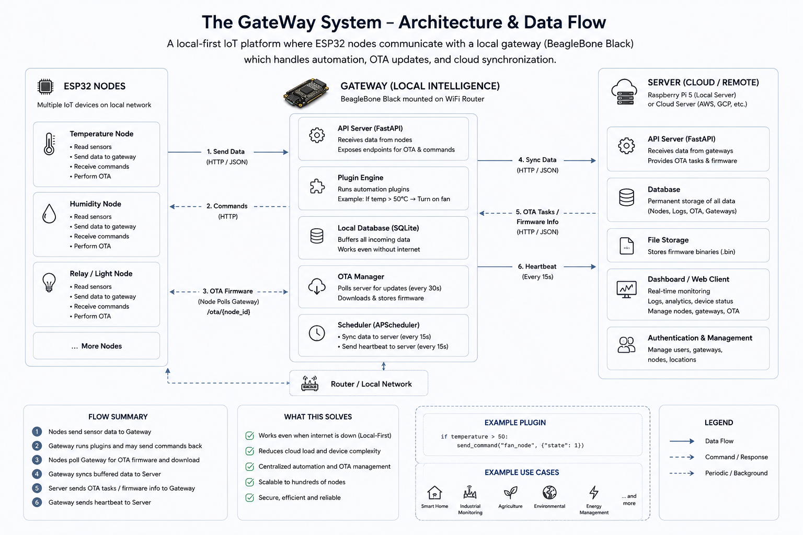

---

# The-Server-System

> The cloud management layer of The GateWay System.


<p style="font-size: xx-small;">This is AI generated image used for visual presentation}</p>

It receives data from local gateways, provides centralized monitoring, stores firmware binaries, coordinates OTA deployments, and offers a web dashboard for managing gateways and IoT nodes across multiple locations.

## What is this?

The Server System is the cloud-facing component of a three-part IoT architecture. Local gateways (running on devices like Raspberry Pi) periodically sync data to this server and poll it for OTA firmware tasks.

This server is responsible for:
- Receiving and storing data forwarded by gateways
- Hosting a near real-time (auto-refresh) web dashboard to monitor nodes
- Storing firmware binaries and coordinating OTA deployments through gateways
- Health-check endpoint for gateway availability and connectivity verification
- Gateway and node inventory management

## Tech Stack

- **Python 3**
- **FastAPI** — REST API backend
- **Pydantic** — Request validation and schema
- **Uvicorn** — ASGI server
- **HTML/CSS/JS** — Single-page dashboard (no framework, pure frontend)
- **Cloudflare Tunnel** *(used for development)* — Exposes local server to gateways publicly

> For production, deploy on AWS, Azure, GCP, or DigitalOcean for better scalability and reliability.

## Design Philosophy

- The system follows a local-first architecture: ESP32 nodes communicate primarily with a local gateway.
- Gateways perform core automation, plugins, commands, and OTA distribution locally so functionality continues when internet connectivity is unavailable.
- Cloud connectivity is used primarily for:
	- Remote monitoring
	- Firmware hosting and coordination
	- Long-term data storage
	- Centralized management and reporting

Local operation and resilience are primary design goals; cloud features augment and centralize management rather than replace local capabilities.

## Project Structure
```
The-Server-System/
├── template.py      # Pydantic models: GatewayPacket, ESPDataModel
├── firmware_send.py # Firmware coordination and helper logic
└── index.html       # Single-page dashboard UI

```
## Data Models

### Incoming Gateway Payload

```json
{
	"gateway_id": "gateway_001",
	"gateway_location": "home_lab",
	"esp_data": {
		"node_id": "sensor_node_1",
		"gateway_time": "2026-04-07T17:24:00",
		"esp_data": {
			"temperature": 23.5,
			"humidity": 60.0
		}
	}
}
```

Heartbeats from the gateway use `node_id: "__heartbeat__"` with empty `esp_data` — used by gateways and the server to track online/offline status.

## Dashboard

The server includes a dark-themed single-page dashboard (`index.html`) for near real-time (auto-refresh) monitoring.

Features (implemented / planned):
- Live view of connected nodes with online/offline status
- Per-node log view with timestamped sensor readings
- Node search and filtering
- OTA firmware upload interface (gateway-mediated)
- Data export to Excel (XLSX) (planned)
- Live streaming mode (planned)
- Animated transitions and breadcrumb navigation (UX)

Note: Where a feature is not yet implemented it is annotated as “(planned)”. The dashboard currently uses polling/auto-refresh rather than WebSockets/SSE unless otherwise noted in the code.

## Setup

### 1. Clone and install

```bash
git clone https://github.com/youruser/The-Server-System.git
cd The-Server-System
pip install fastapi uvicorn
```

### 2. Run the server

```bash
uvicorn main:app --host 0.0.0.0 --port 8000
```

### Expose publicly (development)

Using [Cloudflare Tunnel](https://developers.cloudflare.com/cloudflare-one/connections/connect-networks/):

```bash
cloudflared tunnel --url http://localhost:8000
```

This gives gateways a stable public URL to sync data to.

## API Endpoints

| Method | Endpoint | Description |
|---|---|---|
| `GET` | `/GateWay/Health` | Health check endpoint used by gateways to verify server availability and internet connectivity |
| `POST` | `/{post_auth}` | Receive data packet from a gateway |
| `GET` | `/firmware/{location}/{gateway_id}` | List pending OTA updates coordinated for a gateway |
| `GET` | `/download/{filename}` | Serve firmware binary for gateway download |

## OTA Firmware Management

Firmware `.bin` files are stored on the server. When a new firmware is registered for a target node:

1. Server lists or exposes the firmware via `GET /firmware/{location}/{gateway_id}`
2. Gateway downloads and caches the firmware from the server
3. Gateway distributes the firmware to the target ESP32 node and initiates the OTA process
4. Node flashes and notifies the gateway on completion; the gateway reports status back to the server

## Deployment (Production)

For production environments, replace Cloudflare Tunnel with a cloud platform:

| Platform | Notes |
|---|---|
| AWS EC2 | Full control, scalable |
| DigitalOcean Droplet | Simple, affordable |
| Azure App Service | Managed, enterprise-ready |
| GCP Cloud Run | Serverless, auto-scaling |

Use a reverse proxy (nginx) and HTTPS in production. Ensure proper secrets management and backup for firmware binaries.

## Roadmap

- Multi-gateway management
- Advanced analytics and dashboards
- Alerting and notifications
- Role-based user management
- Enhanced OTA deployment controls (staged rollouts, canary)
- Historical reporting and export


## Part of The GateWay System

- **[IoTCore]** — ESP32 Arduino library (node firmware)
- **[The-GateWay-System]** — Local gateway (FastAPI, Python)
- **The-Server-System** ← You are here

## License

MIT

